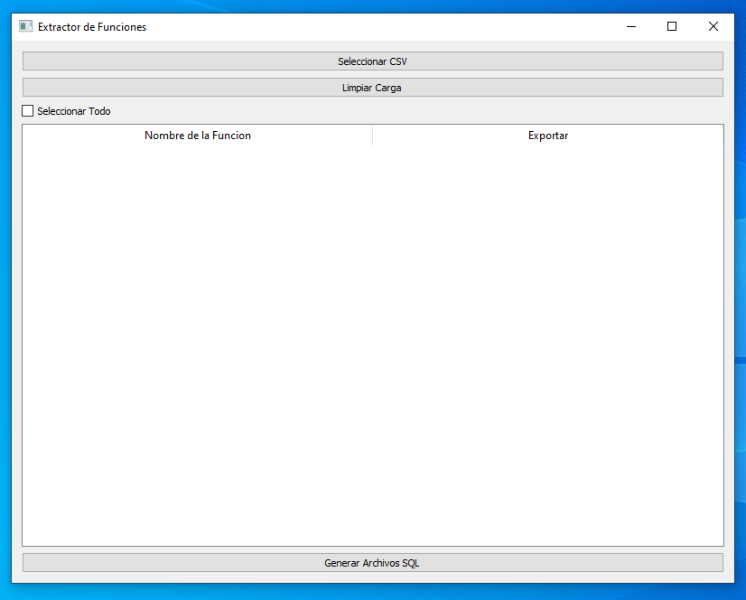

# Extractor de funciones Postgres

Este programa toma un archivo CSV con funciones de postgres  y genera archivos `.sql` independientes, donde el nombre de cada archivo es el valor de la primera columna (`proname`) y el contenido es el valor de la segunda columna (`prosrc`), permitiendo una organización fácil de funciones SQL exportadas.




## Tabla de Contenidos

- [Requisitos](#requisitos)
- [Instalación](#instalación)
- [Uso](#ejemplo-de-uso)
  - [Obtener el archivo CSV](#obtener-el-archivo-csv)
  - [Ejecutar el programa](#ejecutar-el-programa)
- [Opcional: Crear un ejecutable](crear-un-ejecutable)
- [Ejemplo de Uso](#ejemplo-de-uso)
- [Notas](#notas)

## Requisitos

- **Python 3.6 o superior**
- **Biblioteca gráfica** `PyQt5`
- **Generacion de ejecutable** `pyinstaller`
- **Acceso a una base de datos PostgreSQL** para realizar la consulta y generar el archivo CSV

## Instalación

1. Clona este repositorio o descarga el archivo del script:
   ```bash
   git clone https://github.com/Nogthings/psql_function_extractor
   cd psql_function_extractor

## Ejemplo de Uso

## Obtener el archivo CSV
1. Genera el archivo CSV ejecutando la siguiente consulta en tu cliente de PostgreSQL:

   ```sql
    (SELECT proname, prosrc FROM pg_proc WHERE prosrc LIKE '%procedimientos_a_buscar%') TO 'functions.csv' CSV HEADER;

## Ejecutar el programa
2. Simplemente instala la extencion de pyton en vs-code y dale click al boton de ejecutar en el archivo principal del programa `index.py` y este comenzara a ejecutarse o bien desde el terminal ejecuta el siguiente comando:
   ```bash
   python index.py

## Crear un ejecutable

Si deseas crear un ejecutable para simplificar el uso del programa, puedes hacerlo con `PyInstaller`:
   
1. Windows:
   ```bash
   pyinstaller --onefile --windowed --icon=sql.ico index.py

2. MacOS: 
   ```bashs
   pyinstaller --onefile --windowed --ico=sql.icns index.py

Este comando generará un archivo ejecutable en la carpeta dist. Podrás ejecutarlo directamente sin necesidad de tener Python instalado.

## Notas

- Si encuentras algún problema, asegúrate de que el archivo CSV tenga el formato correcto, con `proname` como primera columna y `prosrc` como segunda columna.
- Este programa está diseñado para uso con bases de datos PostgreSQL, y la consulta SQL proporcionada puede no ser compatible con otras bases de datos.
- Asegúrate de tener permisos de acceso adecuados a la base de datos y de respetar las políticas de seguridad y privacidad al exportar funciones.
